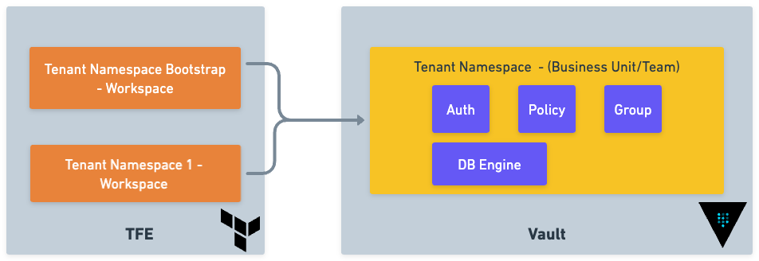

# Vault Adoption

# Hashicorp Vault Adoption Strategy with Ownership Model

One challenge organisations face when adopting Vault is defining a clear ownership model. This is necessary to ensure that access to secrets is properly managed when using a multi-tenant strategy.

To start, we recommend using TFE's [Private Module Registry](https://developer.hashicorp.com/terraform/cloud-docs/registry) to store modules for Vault Namespaces, Vault secrets, and various technologies used by the organization. Each module's configuration should be contained in its own version control system (VCS) repository. These modules should be divided into three categories: Vault Namespaces, Vault Secrets, and Technology.

# Terraform Modules

## Vault Namespace Module

[Example](https://github.com/tallen-hashicorp/terraform-module-vault-demo-bootstrap)

First, the initial Vault namespace will be created by a bootstrapping module. This modules will be responsible for creating the necessary structures and configurations to ensure that the namespace is properly set up. This includes defining the permissions and access controls for the namespace and should contain predefined input variables, such as:

- Team Name
- TFE Project: This should search for an existing TFE project, and if one does not exist, create one.
- Metadata: Such as cost code, ownership, etc.

This namespace module will be managed and approved by the Vault Team and will be responsible for:

- Creating the Namespace
- Setting up organisational auth requirements
- Adding any required policies to the namespace
- Adding known entities and groups based on the input variables.

## Vault Secrets Modules

[Example](https://github.com/tallen-hashicorp/terraform-module-vault-demo-database-secrets)

For each secrets engine used by the organisation, create a separate module. This will enable more granular control over access to each engine, making it easier to manage, track, and approve the configuration of used secrets engines. Furthermore, it will provide a more scalable and flexible approach to secrets management, allowing for new engines to be added as needed without disrupting existing systems.

The module will be responsible for creating and configuring the:

- Secrets engine
- Secrets engine specific roles, such as dev and admin
- Creating Policy for each role
- Creating a group for each policy

## Vault Secrets Group Adding Module

[Example](https://github.com/tallen-hashicorp/terraform-module-vault-demo-group-adding)

To grant entities outside of the namespace access to secrets, you need to create a module that adds entities to groups created by the secrets module. 

Before Vault version 1.13, any policies attached to a group would only apply when the Vault token authorising a request was created in the same namespace as that group, or a descendent namespace. Using the [Group Policy Application](https://developer.hashicorp.com/vault/api-docs/system/config-group-policy-application) allows relaxing that restriction meaning group policies apply to all members of a group, regardless of what namespace the request token came from.

This modules will require the following inputs:

- Entity Name
- Entity Group Name

It's important for entities to use human-readable names so that when users want to grant access to their secrets to users or systems, they can do so easily.

## Organisation Technology Module

[Example](https://github.com/tallen-hashicorp/terraform-module-vault-demo-database)

The previous modules are specifically related to Vault configuration. However, for ownership to be managed and tracked, TFE will also create resources that require secrets management. This can range from creating databases to Active Directory service accounts. The module should use the previously defined Secrets Modules so that, once the resource is created, a corresponding secrets engine will be configured in the namespace.

The Vault-specific modules should be owned, created, and maintained by the Vault Admin team. This allows for centralised control and oversight, by the vault team. However, it is important to note that the technology modules, which depend on the secrets modules, can be owned and maintained by the specific technology teams. By doing so, these teams can ensure that the technology modules are tailored to their specific needs and seamlessly integrated into their overall technology stack with additional secrets management. 

Below is an example of how this may look with the relevant module ownership outlined:


# TFE Configuration

Using modules as building blocks, we can explore the TFE structure and learn how to use it to create a multi-tenant Vault adoption strategy.

We will take advantage of TFE Projects to help organise and centrally manage specific workspaces which will be used for each [Vault Namespace](https://developer.hashicorp.com/vault/docs/enterprise/namespaces). This allows the organisation to work at scale while providing more granular permissions required for the various workspaces. At the highest level the projects should be split into three categories: Vault Admin Projects, Shared Services Projects and Tenant Projects.

## Workspaces



Each business unit or team will have its own Vault Namespace, a dedicated space where they can manage their own secrets. This ensures that each team has a secure and isolated environment where they can safely store and retrieve or share sensitive data. The Vault Namespace Module, as previously mentioned, will be used to set up each namespace, establishing the organisations best practice are properly configured.

By creating these separate Vault Namespaces, businesses can effectively compartmentalise their sensitive data and restrict access to only those who need it. This helps to mitigate the risk of data breaches and other security incidents, as well as promote compliance with various data protection regulations.

In order to allow each business unit or team, a second workspace will be used. This workspace will focus on tenant specific items, including but not limited to databases, vault database dynamic secrets engine, AD service account, and Vault Secrets LDAP (Static credentials). By utilising a separate workspace for these items, we can ensure that each tenant's unique needs are met and their specific configurations are properly managed. This approach also allows the Vault admin team to manage the high-level creation of namespaces, while enabling each business unit to self-manage their own namespace.

## TFE Projects

To facilitate permissions for the main two types of workspace we recommend taking advantage of TFE’s project feature. Using projects  you can organise your workspaces into groups allowing you to  scope and assign workspace access, reducing the likelihood of permissions errors.  This helps teams manage the workspaces they are responsible for while making it easier for organisation owners to follow the principle of least privilege.

### Vault Admin Projects

We recommend using at least two main types of projects, in addition to the two main types of workspace. The first type is the Admin team's project, which will be granted full permission to the Vault instance, allowing the creation of namespaces and any other configurations needed for the Admin team. Any workspace in this project can also have permission to use any module from the module registry. 

### Tenant Projects

To ensure limited access to Vault, create a tenant-specific project with a custom role that only has the necessary permissions. Also, configure the project's workspaces to only access the specific modules from the registry required for the project, such as Organisation Technology Modules and Vault Secrets Modules. By doing this, the project can be better configured to meet the team's needs and ensure that only relevant parties have access to the necessary information.

### Shared Services Projects

There may be times when the Vault Admin team wishes to add secrets that can be shared by the entire organisation. In order to achieve this, a third project can be created that has similar access to the Vault Admin project. However, this project is used to separate secrets configuration from namespace bootstrapping workflows. This will be very similar to a specific tenant namespace configuration; however, the Admin team will own this and therefore having increased privileges is appropriate.


## Putting it all together

Now we have all the components to allow an organisation to efficiently adopt Vault, while defining a clear ownership model to ensure that access to secrets is properly managed when a multi-tenant strategy is used.

The Vault admin team will be responsible for managing the Bootstrapping Modules and Vault Secrets Modules. This team will also be responsible for creating new namespaces as new business units or tenants require them.

Specific technology organisation teams can be responsible for creating and managing Organisation Technology Modules, configuring the organisational technology. These modules will use the Secrets Modules so that when teams wish to add secret capabilities, they can simply add the module to their codebase to enable this.

Each business unit or tenant will then be able to quickly request new technology components, such as a new Postgres database, by adding this to their namespace repo. Once approved by the relevant teams, all of the infrastructure and relevant secrets can be created.


---
# How to use this repo
This repository serves as a demo for using the Vault adoption described above. It should not be used for production environments.

# Components

- **Docs** - Contains images for this README
- **service-api-backend** - A simple backend used for Sentinel policy
- **service-frontend** - A simple frontend used for easy control of services showcased in Sentinel policy
- **workspace-demo-ec2** - Deploys an EC2 instance which runs the demo frontend and backend for Sentinel policy
- **workspace-tenant1-bootstrap** - Example workspace for bootstrapping Tenant 1 Vault namespace
- **workspace-tenant1-custom** - Example workspace for adding database and secrets to Tenant 1
- **workspace-tenant2-bootstrap** - Example workspace for bootstrapping Tenant 2 Vault namespace

## Prerequisites

- A TFC/TFE [Organization](https://developer.hashicorp.com/terraform/cloud-docs/users-teams-organizations/organizations#creating-organizations)
- A [Vault Enterprise](https://www.hashicorp.com/products/vault/pricing) installation
- A Postgres installation
- Access for TFC/TFE to access Vault. TODO: investigate this later, currently using userpass
- An AWS Account

## Instructions

1. Add the following modules to your TFE/TFC Organsiation. You can use [this](https://developer.hashicorp.com/terraform/cloud-docs/registry/publish-modules) guide
    - [terraform-module-vault-demo-bootstrap](https://github.com/tallen-hashicorp/terraform-module-vault-demo-bootstrap)
    - [terraform-module-vault-demo-database](https://github.com/tallen-hashicorp/terraform-module-vault-demo-database)
    - [terraform-module-vault-demo-database-secrets](https://github.com/tallen-hashicorp/terraform-module-vault-demo-database-secrets)
    - [terraform-module-vault-demo-group-adding](https://github.com/tallen-hashicorp/terraform-module-vault-demo-group-adding)
2. Deploy an EC2 instance from workspace-demo-ec2 using terraform and note the IP address returned in the terraform output. This will use the pre-built public images.

```bash
cd workspace-demo-ec2
terraform init
terraform apply
```

3. Update `line 5`  in `sentinel-vault-demo/restrict-bootstrap-on-api.sentinel` to use the IP from step 3. Once updated create a new [policy set](https://developer.hashicorp.com/terraform/cloud-docs/policy-enforcement/manage-policy-sets) in your TFE/TFC org to apply to all workspaces

```go

req = http.request**("http://54.211.31.66:3001")**
```

4. Create 3 workspaces in TFE/TFC called:
    - `workspace-tenant1-bootstrap`
    - `workspace-tenant1-custom`
    - `workspace-tenant2-bootstrap`
5. Add environment variables to each workspace for VAULT_ADDR & VAULT_TOKEN to include the Vault URL and token. This can also be achieved using [Variable Sets](https://developer.hashicorp.com/terraform/cloud-docs/workspaces/variables#scope) 


6. Update the following changing the TFE/TFC configuration in the [main.tf](http://main.tf) file to match your org
    - `workspace-tenant1-bootstrap`
    - `workspace-tenant1-custom`
    - `workspace-tenant2-bootstrap`
7. Run Terraform init and apply on each workspace